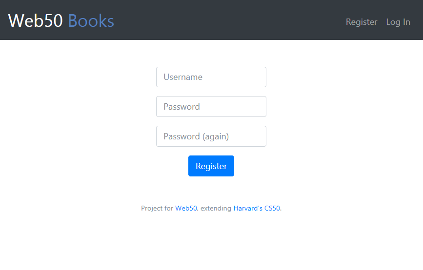
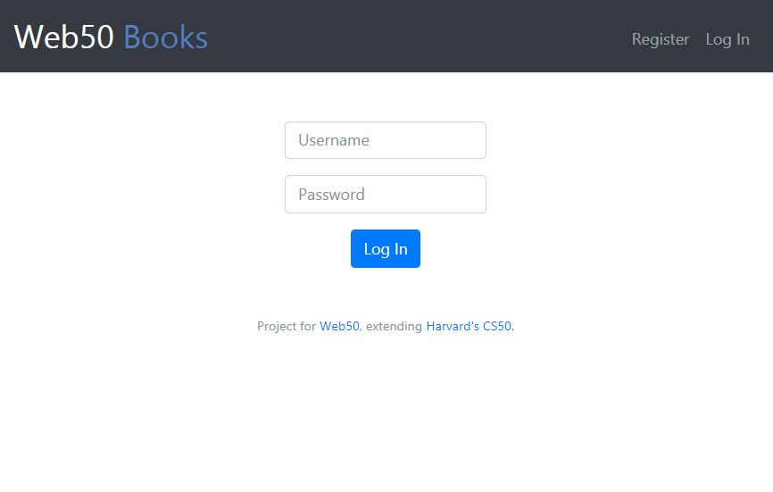
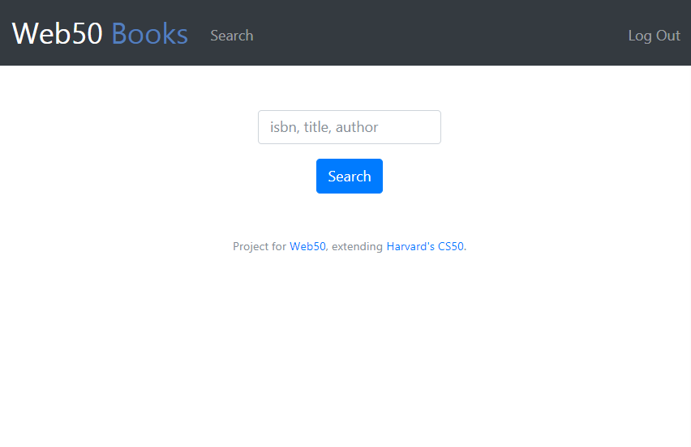
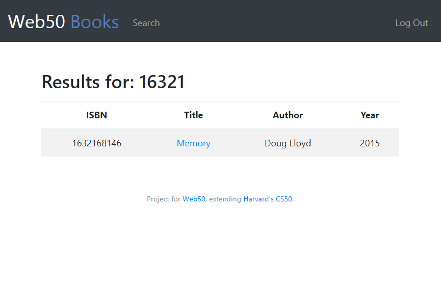
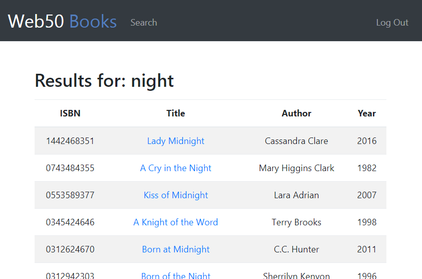
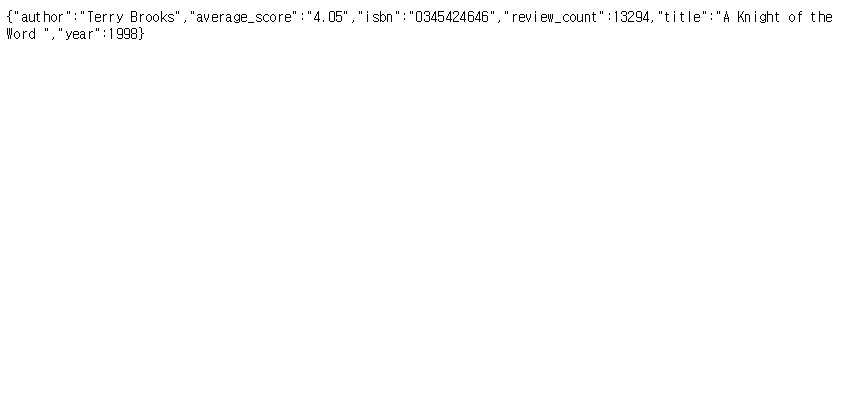
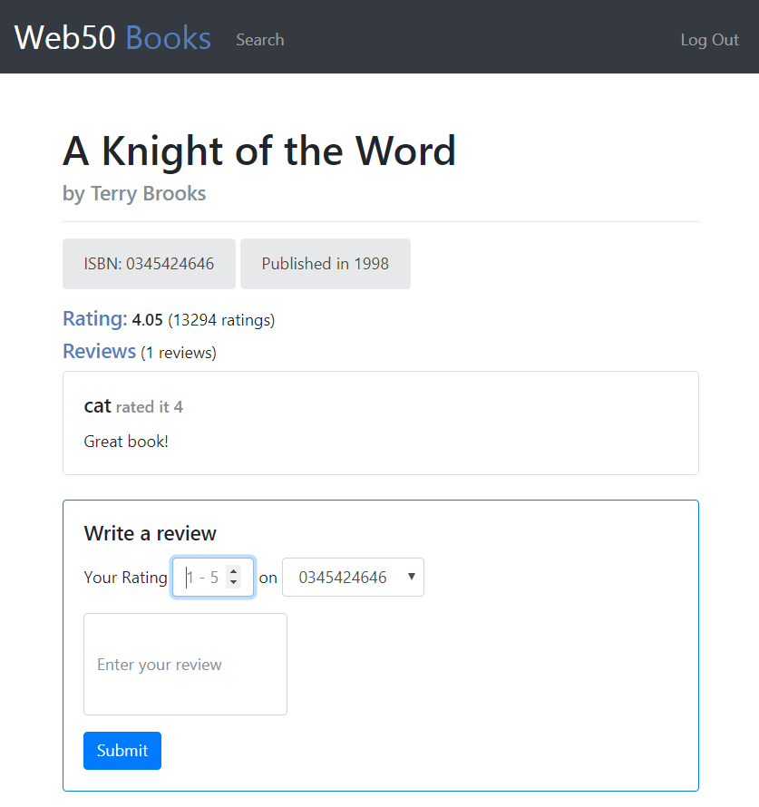

# Web50 Project 1 | Web50 프로젝트 1
> Practicing Back-end development using Python, Flask (server framework), PostgreSQL database (+SQLAlchemy), and APIs to create a book review website.

> Python, Flask, PostgreSQL 데이터베이스(+SQLAlchemy), API를 사용하여 간단한 북리뷰 사이트를 개발해 보는 백엔드 웹 개발 연습.

## Project 1: Book Review Website
- For CS50 Web Programming with Python and JavaScript.
- Created a book review website using Python and `Flask` as the server framerwork.
- Used `PostgreSQL database` (deployed in `Heroku`) and `sessions` to store login credentials.
- Also ssed the database for storing and searching book information including the isbn, title, author, ratings, and reviews.
- A `third-party API` by Goodreads (a book review website) to use ratings on books.
- Created `a custom API` for the Website so that a GET request ("api/<isbn>") returns a JSON for book details.
  
| /register | /login |
:-------------------------:|:-------------------------:
 | 
| user can register | user can login |

| /search | /search (by isbn) |
:-------------------------:|:-------------------------:
 | 
| search for book by isbn, title, author | search result by isbn |

| /search (by title)  | /api/isbn |
:-------------------------:|:-------------------------:
 | 
| search result by title | API for web applicatio |

| /book/isbn || /search (no match)  |
:-------------------------:|:-------------------------:
 | 
| review of searched book | no match for search result |

## 프로젝트 1: 북리뷰 웹사이트 개발
- 하버드의 CS50 MOOC(edX)의 Web Programming with Python and JavaScript 수업의 프로젝트 1.
- Python과 `Flask`를 서버 프레임워크로 사용하여 북 리뷰 웹사이트를 개발.
- `PostgreSQL` 데이터베이스를 사용하여 책의 정보(isbn, 제목, 작가, 평점)을 저장 및 검색하는 기능을 만듦.
- 마찬가지로 PostgreSQL을 사용하여 웹사이트에서 만들어진 북 리뷰를 저장 및 검색하는 기능을 만듦.
- `Session`과 데이터베이스를 사용하여 로그인 기능을 만듦.
- Goodreads (타사 북 리뷰 웹사이트)의 `API`를 사용하여 평점 정보를 불러오는 기능을 만듦.
- `웹사이트의 API`를 만들어 GET request ("api/<isbn>")를 통해 JSON 파일을 반환하는 기능을 만듦.

## what I learned | 무엇을 배웠는가
> Still a bit confused on whether I prefer back-end or front-end. Still, I learned that one side alone is not sufficient since you must know both sides in order for the logic to work. 

> Specifically, I learned how to create a logic using the routes in how the user is suppose to use and have access to pages (how the website as a whole should flow).
- learned how to use `Flask as a server framework` in order to direct the application's routes
- learned how to use `relational databases` via `PostgreSQL` and how to implement it using SQLAlchemy
- learned how to use `sessions` to store login credentials. 
- learned how to use `third-party APIs` and also create `custom APIs` to return JSONs.
